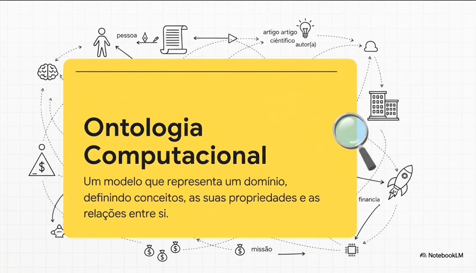
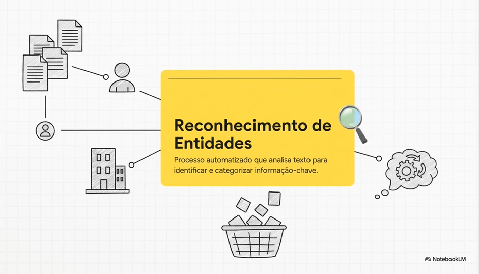

### Sobre as referências

- Cognitive Semantics of Artificial Intelligence
- Semantic AI in Knowledge Graphs
- Semantic Web for the Working Ontologist

Não foram adicionadas por limitação de armazenamento, já que são livros extensos sobre o tema.

### INTRO

Eu sou o João e gostaria de enfartizar antes de tudo, o poder das conexões.
Eu conheço o Rafael, que conhece o Marcelo, que conhece o Diniz, que conhece o Shannon, que conhece o Boole.

Brincadeiras a parte, a noção que estamos a cerca de 6 apertos de mão de qualquer pessoa do mundo vem em grande parte do experimento de Stanley Milgram, de 1967. Um sociólogo que queria medir a distância entre as pessoas nos EUA, então ele escolheu 2 destinatários na região de Boston e pediu para voluntários que moravam pelo país fazerem uma carta chegar para essas pessoas passando por intermediários que podiam ou não conhecer os destinatários ou alguém lá no meio. Até então não se fazia ideia de quantos passos seriam necessários. Das 160 cartas iniciais, 42 chegaram até o destino final e na média, elas precisaram passar por pouco menos do que 6 intermediários. Essa noção foi explorada em uma peça que depois virou um filme chamado SEIS GRAUS DE SEPARAÇÃO.

Claro que dizer que as cartas que chegaram ao destino explicam a quantos intermediários as pessoas estão no mundo todo é forçar um pouco a barra. Isso pode ser medido de outra forma e quem pode explicar isso é o estudo das redes complexas e a teoria dos grafos, que podemos atribuir a criação ao matemático suíço Leonhard Euler. Para quem quiser saber mais sobre o tema eu deixo de recomendação o Livro Linked, escrito por Laszlo Barabasi, outro cara brilhante que mostra entre os muitos grandes feitos de Euler, a resolução do desafio das pontes do Rio Pregel, em Königsberg, hoje conhecida como Kaliningrado. Em 1735, o Rio Pregel que corta a cidade tinha 7 pontes que cortavam a cidade e ligavam ela a pequenina ilha de Kneiphof e o desafio da época era atravessar todas as pontes sem repetir nenhuma. Ele representou cada ponte como traços e as margens como nós ou vértices e em 1736 mostrou que o desafio era impossível. Depois demonstrou que, para existir um caminho que passe por todas as arestas sem repetir nenhuma, no máximo dois nós podem ter grau ímpar. Como todos os quatro nós do mapa original tinham grau ímpar, o problema não tinha solução.

Certo, mas o que isso tem haver com grafos de conhecimento? Ai que eu lhe digo, tudo, deixa eu te mostrar a conexão.

Hoje em dia estamos vivendo em uma era de fatura de dados, mesmo sem compreender de fato o significado de alguns. E se uma máquina fosse capaz de fazer conexões que passam despercebidas por nós humanos? Vamos falar sobre uma tecnologia capaz de ensinar computadores não somente a ler dados, mas entender de verdade seu significado. Para um computador, 'NASA' e 'missão espacial' são apenas sequencias de bits, não ideias que se conectam, falta o entendimento do contexto que para nós é quase instintivo. É como se colocassemos uma criança para ler uma lista telefônica (antigo ein, quem lembra o que é isso?) e ela dirá: 'Certo, tem um montão de palavras e números, mas onde está a história?'. Justamente essa barreira que o conceito de IA Semântica busca derrubar. Uma das soluções para isso é uma ideia que particularmente considero ao mesmo tempo elegante e genial. Utilizar grafos de conhecimento.

---

### DEFINITION

Vamos começar pelo básico. Imagine que você está assistindo a um jogo de futebol. Você pode criar um grafo de conhecimento bem simples com base no que você vê. Basta representar cada jogador em campo como um nó e use uma linha ou aresta para conectar os nós com base nas ações que eles realizam, como passar a bola. Essa teia de jogadores e suas ações é um exemplo de Grafo de Conhecimento.

De forma mais geral, os nós representam entidades, como pessoas, lugares ou coisas, e as arestas representam os relacionamentos entre elas. É uma forma de organizar a informação que destaca conexões e interações. Cada nó pode armazenar dados ricos; no exemplo do futebol, isso poderia ser as estatísticas de um jogador, sua posição ou até mesmo seu desempenho histórico. As arestas também podem armazenar dados, como pesos que representam o número de passes entre os jogadores. E, uma vez que o grafo de conhecimento está completo, você pode usá-lo para fazer previsões sobre os resultados dos jogos, descobrir os melhores jogadores para recrutar para um time, e mais.

Como isso difere de um banco de dados ou planilha tradicional? Em ambos os casos, a informação é armazenada em tabelas com linhas e colunas. Isso é ótimo para dados estruturados, mas rapidamente se torna impraticável ao lidar com relacionamentos complexos. Um Grafo de Conhecimento, por outro lado, é como um mapa de dados, onde você pode ver facilmente como tudo está conectado e pode realizar operações matemáticas em diferentes partes do mapa.

Vamos pensar nele como uma espécie de cérebro digital. Em vez de armazenarmos palavras isoladas, ele mapeia as relações entre as coisas, portanto ao guardarmos a palavra 'NASA', ele conecta a ideia de que essa palavra significa 'uma organização que realiza missões espaciais'. Tecendo uma teia de  compreensão.

Isso torna possível descobrir insights e padrões que não são imediatamente óbvios em um banco de dados ou planilha. Por exemplo, você pode rastrear a frequência com que os jogadores interagem ou como várias proteínas interagem em uma célula biológica. Os grafos de conhecimento também permitem que você adicione facilmente novos tipos de relacionamentos entre os dados e que extrapole a partir dos dados, o que pode ser usado para inferir e validar a aplicabilidade do nosso conhecimento atual às nossas previsões.

A construção e análise de grafos de conhecimento envolve ferramentas matemáticas e de programação avançadas e pode incorporar aprendizado de máquina (machine learning). Bibliotecas de software podem ajudar a gerenciar as estruturas do grafo e realizar operações como análise do caminho mais curto (shortest path analysis), medidas de centralidade e detecção de comunidade. Enquanto algoritmos podem calcular similaridades e prever novas conexões ou relações causais.

Como eu falei antes, esse conhecimento pode ser usado em várias áreas.

Em mídias sociais, um Grafo de Conhecimento pode mapear suas conexões e interesses. Se seu amigo ama um restaurante específico, a plataforma pode recomendar o mesmo restaurante a você, com base na força da conexão com seu amigo e nos outros dados relacionados às suas preferências alimentares e lugares que você gosta de visitar.

Na descoberta de medicamentos (*drug discovery*), os grafos de conhecimento ajudam os cientistas a gerenciar e analisar vastas quantidades de dados biológicos. Eles podem prever como um novo medicamento pode interagir com proteínas no corpo, identificando alvos de doenças para medicamentos e potenciais efeitos colaterais, economizando tempo e recursos significativos no processo de pesquisa. Isso envolve consultar o grafo para identificar potenciais alvos de medicamentos e interações.

Essa proposta veio como uma forma diferente de armazenar, gerenciar e analisar nossos dados, tornando possível manipular eficientemente conjuntos de dados complexos, revelar conexões intrincadas e facilitar decisões poderosas baseadas em dados, mesmo quando temos informações limitadas sobre um assunto. Seja ajudando você a encontrar seu próximo restaurante favorito ou descobrindo medicamentos que salvam vidas, os grafos de conhecimento são a teia de nossos *insights* compartilhados e validados, e estão moldando o futuro da tecnologia e da ciência.

Tudo parece muito lindo até aqui, mas vamos entender o tamanho do problema que essa tecnologia se propõe a resolver. Vamos entrar no labirinto do fauno, quer dizer, de dados.

---

### PROBLEM

O grande problema é que nossos dados se parecem bastante com bilionários. Vivem em ilhas completamente isolados.

Deixe-me formular corretamente: O problema é a fragmentação epistemológica.

Parece até um golpe de cavaleiros do Zodiáco, mas não é.

Em termos técnicos, o desafio é:

Pense em cada base de dados com um silo: artigo científico, relatório policial, exame laboratorial, notícia jornalística, conversa em rede social. Cada um é uma ilha.

As relações existem, mas:
- estão distribuídas
- não são estruturadas
- não têm semântica explícita

Sem integração semântica, não há:
- inferência
- consolidação
- descoberta de padrões

Essas conexões ausentes podem significar um risco real:
- pesquisa médica perdida
- diagnóstico atrasado
- investigações incompletas
- decisões ruins

Isso é exatamente o que grafos de conhecimento tentam mitigar: ligar pontos que já existem, mas não estão conectados estruturalmente e semanticamente.

Um exemplo interessante é o que acontece com relatórios policiais. Na prática são um monte de pontos isolados no mapa, até que alguém estuda isso, liga esses pontos e revela um padrão de uma rede criminal que vai desde o aliciamento de menores em comunidades carentes até os maiores empresários do país, localizados em bairros de alto padrão ou até empresas do mercado financeiro em prédios luxuosos.

Veja que a falta dessas conexões não é só sobre perder ideias, pode até custar justiça. Se de fato sabemos o que é.

Tudo bem até aqui? Pausa para água... Certo, como que se constrói essa oitava maravilha do mundo? Os famosos 3 passos fundamentais:

- Ontologia — regras, classes, relações
- Extração semântica — NER + Relation Extraction
- Construção do grafo — ingestão + linking + inferência

Vamos falar um pouco mais sobre a Ontologia. É como se fosse a gramática deste cérebro digital. Não basta saber que existe a palavra pessoa e a palavra artigo, a ontologia é que define as regras de como essas palavras se conectam. Montar uma ontologia não é apenas “fazer uma lista de classes”, é um processo técnico e metodológico que mistura engenharia de software, filosofia, linguística, modelagem de dados e ciência cognitiva. Vou mostrar um caso realista, incluindo tanto a parte conceitual quanto a prática (OWL, RDF, ferramentas, padrões).

1. Identificação do domínio e do objetivo

Antes de criar qualquer classe, você define:

Domínio: sobre o quê a ontologia fala?
(ex.: futebol, crimes, biologia molecular, documentos legais)

Objetivo: para quê ela será usada?

organizar conhecimento?

alimentar um grafo de conhecimento?

permitir inferência lógica?

servir de base para NER?

Essa etapa define o escopo — sem isso, a ontologia vira um monstro incontrolável.

🧩 2. Levantamento do vocabulário (Glossário do domínio)

Aqui você coleta:

termos importantes (proteína, gene, jogador, evento...)

relações comuns (interage_com, marca_gol, inibe, localiza...)

atributos relevantes (altura, peso, ID, tempo, data...)

sinônimos e variações (“time”, “equipe”)

Fontes:

artigos científicos

bases de dados existentes

especialis­tas do domínio

livros e reportagens

legislações e relatórios oficiais (se for crime)

entrevistas com usuários

O objetivo é responder:
Quais são os elementos fundamentais desse universo?

🗂️ 3. Agrupamento em categorias (Classes)

Agora você transforma o vocabulário em:

classes
Ex.: Jogador, Time, Partida

subclasses
JogadorAtacante ⊆ Jogador
GeneHumano ⊆ Gene

instâncias (opcional no começo)
Neymar : Jogador
Palmeiras : Time

A regra técnica:
classes representam tipos, instâncias são indivíduos reais.

🔗 4. Definição das propriedades

As propriedades são as verdadeiras joias da ontologia.

➤ Object Properties (ligam entidades entre si)

passaPara (Jogador → Jogador)

localizadoEm (Time → Cidade)

regula (Gene → Proteína)

➤ Data Properties (ligam entidade a um literal)

temIdade : Pessoa → xsd:int

temNome : Entidade → xsd:string

temData : Evento → xsd:date

Essas propriedades vão virar as arestas semânticas do grafo.

🧭 5. Definição de domínio, range e restrições

Agora você “fecha” o sistema dizendo:

Domínio: quem pode usar a propriedade

Range: para onde ela pode apontar

Cardinalidade: quantos valores são permitidos

Tipagem: obrigatoriedade de tipos

Exemplo OWL:

ObjectProperty: passaPara
    Domain: Jogador
    Range: Jogador

DataProperty: altura
    Domain: Jogador
    Range: xsd:float

Isso permite ao motor inferir erros e novos fatos.

🧮 6. Modelagem lógica (restrições OWL)

Aqui entra a parte formal da ontologia.

Você cria axiomas:

✔ Classes disjuntas
DisjointClasses: Atacante, Goleiro, Zagueiro

✔ Restrições existenciais (algum)

“Todo jogador joga em pelo menos um time”

Jogador SubClassOf jogaEm some Time

✔ Restrições universais (somente)

“Todo gol é marcado apenas por jogadores”

Gol SubClassOf marcadoPor only Jogador

✔ Regras lógicas

“Se algo é um gene e regula outra coisa, então é um regulador”
(com reasoner automático)

🧪 7. Testes com um reasoner semântico (HermiT, Pellet, FaCT++)

O reasoner verifica:

inconsistências (“Atacante é jogador, mas você disse que Jogador é disjunto de Atacante”)

inferências novas (“se X é Partida e tem Data, então é um Evento”)

redundâncias

erros de cardinalidade

Isso garante que a ontologia é sólida matematicamente.

📦 8. Implementação em OWL / RDF

A ontologia agora é codificada em formatos padrões:

OWL (Web Ontology Language — o mais usado)

RDF(S) — mais simples

SHACL — para validação de grafos

A ferramenta mais comum é:

➤ Protégé

Um editor visual (gratuito) usado no mundo inteiro.

Você usa Protégé para:

criar classes

definir restrições

rodar reasoners

exportar para OWL

visualizar o grafo

🧱 9. População do grafo (instâncias reais)

Com a ontologia pronta, você começa a adicionar:

pessoas reais

genes reais

jogadores reais

eventos reais

crimes reais

Isso pode ser:

manual (demorado)

automático (com NER + Entity Linking + Relation Extraction)

Essa etapa gera milhões (ou bilhões) de triplas.

🔗 10. Integração com sistemas que vão usar o grafo

A ontologia agora serve de base para:

mecanismos de NER semântico (baseados em classes)

motores de recomendação

sistemas jurídicos

descoberta de medicamentos

grafos de compliance

sistemas de busca inteligente

---

É preciso criar o que os engenheiros e arquitetos chamariam de planta baixa, um projeto, que os mais próximos chamam de ontologia, no fundo é o livro de regras que diz o que é importante e o que estamos procurando.

Depois o computador analisa os textos e extrai os fatos importantes e por fim vem a mágica. (Não tem mágica infelizmente...) No final ele constrói a rede conectando os pontos para gerar o conhecimento

Exemplo: Uma pessoa pode ser autora de um artigo

É essa estrutura que transforma uma lista de informações soltas em uma rede de conhecimento que faz sentido.

Certo, mas como esse ecossistema, se podemos chamar assim, encontras os dados para preencher essa estrutura. Ai vamos começar a ser mais técnicos, nesse ponto entra um processo chamado "Reconhecimento de entidades nomeadas (NER)"

Uma forma de simplificação para o entendimento disso, é como se fosse um marcador de texto super inteligente. O modelo lê o documento e vai destacando o que é uma pessoa, o que é uma organização, o que é um termo técnico e até o que é uma apresentação ruim. É assim que a matéria-prima do conhecimento é recolhida do texto bruto. E olhem só para este exemplo que mostra isto na perfeição. É um antes e um depois. À esquerda temos um trecho normal de um artigo da NASA e à direita o mesmo texto, mas depois de passar pelo processo de NER. Vejam como o sistema identificou sozinho que Ryan McGranhan é uma pessoa e que NASA e CFAH são organizações. É aqui que a máquina começa a enxergar o significado por trás das palavras.

Uma forma mais técnica: NER é uma das primeiras etapas na construção de um grafo de conhecimento. Ele identifica “coisas” no texto, pessoas, locais, organizações, conceitos etc para que depois possamos ligá-las em forma de grafo.

Deixa eu dividir em passos para facilitar

1. Entrada: texto não estruturado

Exemplos: “O Marcello vai pontuar o João e o Breno com A na matéria no final do semestre.”

O primeiro passo é transformar esse texto em entidades e relações.

2. NER — Reconhecimento de Entidades Nomeadas

O NER identifica e classifica entidades no texto. Os modelos comuns: spaCy, BERT, RoBERTa, Flair, GPT, Stanza. São pré-treinados para isso. O NER rotula trechos com categorias como:

PERSON
ORG
LOCATION
DATE
PRODUCT

Marcello, João, Breno → PERSON
final do semestre → DATE

3. Normalização / Desambiguação (Entity Linking)

NER só detecta o nome — mas não sabe qual Apple, nem qual Alan Turing em um banco de dados maior.

Entity Linking conecta cada entidade ao seu ID global:

Alan Turing → wikidata:Q7259

Apple → wikidata:Q312

1940 → wikidata:Q1994

Isso evita duplicação e permite unificar dados.

4. Extração de relações (Relation Extraction)

Depois que temos entidades, o sistema determina como elas se conectam.

Técnicas:

Regras linguísticas (sujeito–verbo–objeto)

Dependência sintática

Modelos supervisionados (BERT para RE)

Modelos grandes (LLMs) para extração supervisionada ou zero-shot

Exemplo:
Texto:

"Turing trabalhou na Apple."

Relação extraída:

(Alan Turing) — trabalhou em → (Apple)

5. Construção do grafo

Cada entidade vira um nó
Cada relação vira uma aresta
Cada tipo de entidade vira um rótulo

Exemplo de grafo:
Alan Turing --trabalhou em--> Apple
Alan Turing --atividade em--> 1940

Representações comuns:

RDF / OWL (Web Semântica)

Property Graph (Neo4j)

GraphML / NetworkX

6. Enriquecimento

O grafo pode ser expandido com:

informações adicionais da web

bases estruturadas (DBpedia, Wikidata)

outros documentos processados por NER

7. Armazenamento e consulta

Com o grafo montado, você pode consultar com:

SPARQL (RDF)

Cypher (Neo4j)

Gremlin

Exemplo em Cypher:

MATCH (p:Person)-[:TRABALHOU_EM]->(o:Organization)
RETURN p, o;

Mas quão bom é o sistema a fazer isto?. Bem, estes números de um caso de estudo real da NASA dão-nos uma ideia muito clara. A **precisão [é de] 100%**. Isto é incrível. Significa que tudo o que ele identifica, identifica corretamente. Só que o **recall é de 66,6%**. O que é que isto quer dizer?. Que ele ainda deixa escapar mais ou menos 1/3 dos peixes que estão no lago. Ou seja, ele é super preciso no que apanha, mas ainda precisa de aprender a apanhar tudo o que existe.

Tudo bem, a teoria é interessante, mas e na prática? Porque é que construir este cérebro digital é algo tão importante?. Vamos ver alguns exemplos bem concretos do mundo real. Olhem este caso. Em Modena, na Itália, a polícia lá usa esta tecnologia para ligar os pontos nos relatórios de crimes. Pensem bem, um roubo aqui, um carro suspeito, avistado ali. Sozinhos são só ruído, informação solta. Mas o **grafo de conhecimento consegue ligar esses pontos**, seja por um local, um horário ou uma descrição em comum. E de repente ele revela padrões que um analista humano talvez nunca conseguisse ver. Ele transforma dados aleatórios numa ferramenta poderosa de prevenção.

E na educação, o potencial é de revolucionar a forma como se aprende. Imaginem um sistema que entende que a competência em álgebra linear está muito ligada a *machine learning*. Se um aluno vai bem na primeira, o sistema pode, de forma proativa, sugerir a segunda. Isto cria um **caminho de aprendizagem totalmente personalizado** que se adapta aos pontos fortes de cada um. Em vez daquele *curriculum* de tamanho único que conhecemos.

Agora, um exemplo que é literalmente uma **questão de vida ou morte**. No sul da Nigéria, um sistema usa um grafo de conhecimento para traduzir alertas de emergência para línguas locais que muitas vezes os tradutores automáticos normais não cobrem. Isto simplesmente **quebra barreiras linguísticas em situações críticas**, garantindo que informações vitais cheguem a quem precisa na hora certa.

Pois é, todos estes exemplos apontam para uma direção muito clara. Não estamos a falar de uma melhoria pequena, incremental. Estamos a falar de uma **mudança fundamental na maneira como interagimos com a informação**. Então, para resumir a ideia central, os grafos de conhecimento **tornam o inacessível acessível**. Eles permitem-nos encontrar aquela **agulha no palheiro de dados**, seja a conectar pesquisas científicas, a ajudar a combater o crime ou, como vimos, até salvar vidas. Nós deixamos de apenas procurar informação para passar a **dialogar com ela, a fazer-lhe perguntas de verdade**. E tudo isto leva-nos a uma reflexão final. Nós estamos a construir máquinas que não só processam palavras, elas estão a começar a **entender o mundo de ideias por trás delas**. E à medida que esta tecnologia se torna cada vez mais poderosa, a pergunta mais importante talvez não seja o que é que ela pode fazer, mas sim que perguntas é que nós vamos escolher fazer-lhe primeiro? Fica a reflexão.

